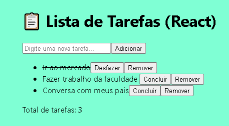

# 📋 Lista de Tarefas - React

Projeto de lista de tarefas desenvolvido com React, com persistência de dados usando `localStorage`.

----
## 🚀 Funcionalidades

- Adicionar novas tarefas
- Marcar/desmarcar como concluída
- Remover tarefas
- Persistência de dados (localStorage)
- Interface responsiva

----
## 🛠 Tecnologias

- React (useState, useEffect)
- CSS3
- JavaScript ES6+
- Git & GitHub

----
## 📸 Preview



## 🚀 Demonstração

🔗 **Deploy:** 🌐 Deploy
[Em breve – GitHub Pages]

----
## 🔗 Como executar

```bash
npm install
npm start

----

Desenvolvido com ❤️ por João Victor